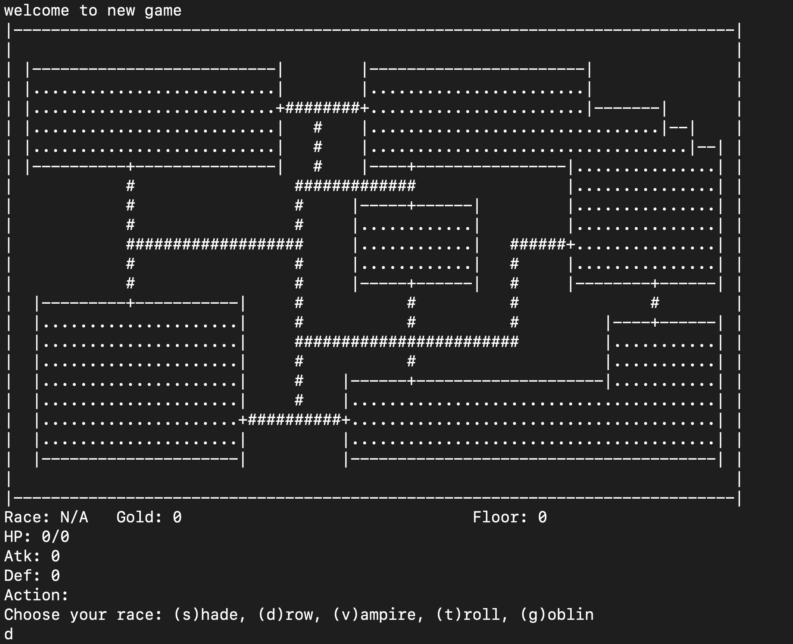
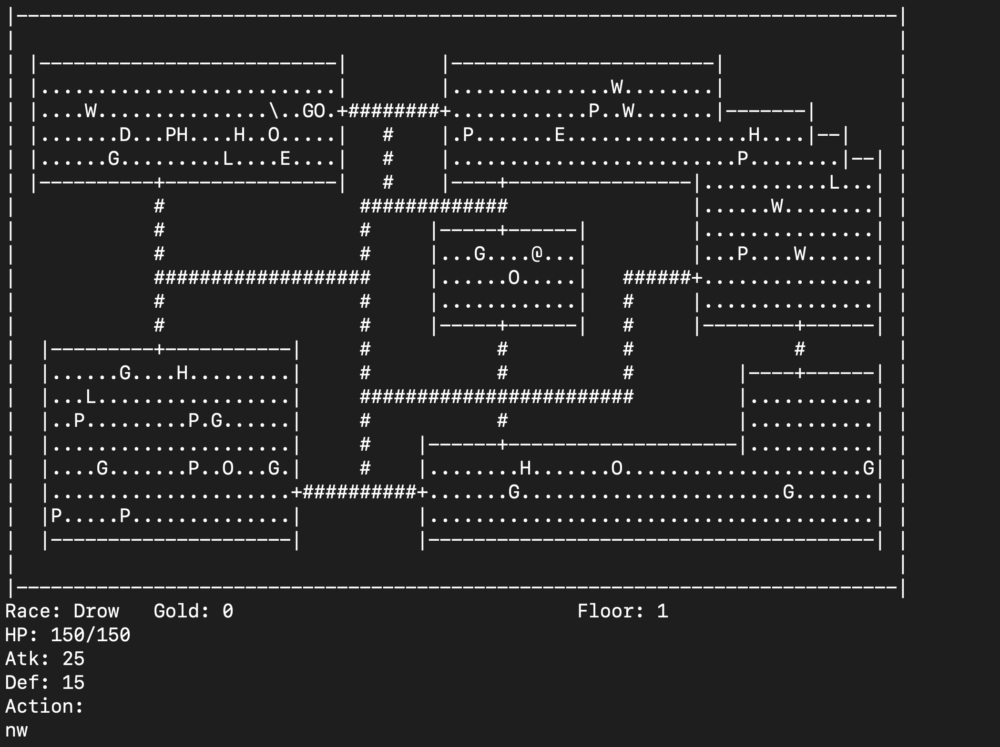
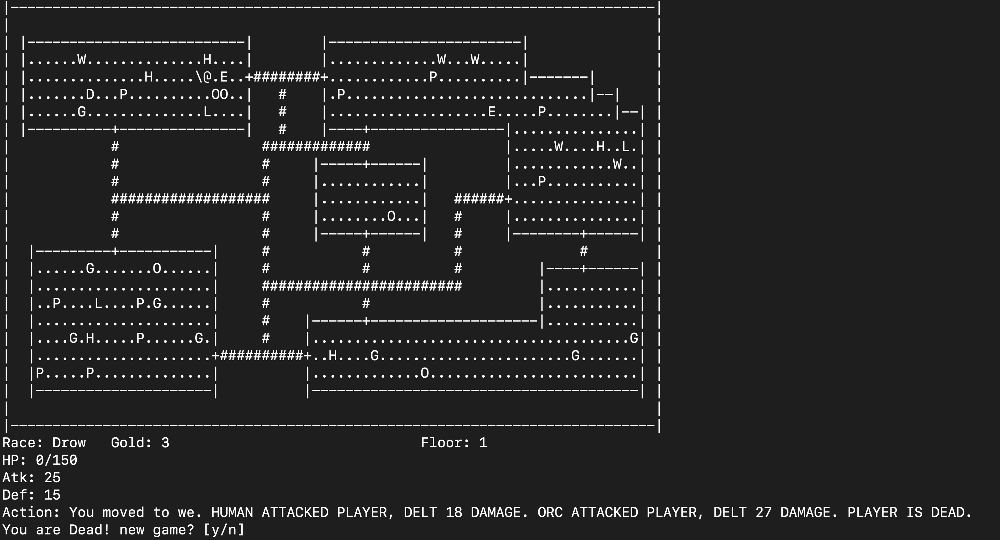

# ChamberCrawler3000
This is a simplified rogue-like video game, ChamberCrawler3000 (CC3k). \
This game consists of a board 79 columns wide and 30 rows high (5 rows are reserved for displaying current state of the player).  \
In the game, the player character moves through a dungeon and slays enemies and collects treasure until reaching the end of the dungeon(the 5th floor), or end up killed by enemies. \

To boost the game:
``` Bash
make
./cc3k
```
This is the initial map. '|' and '-' indicate walls, '.' indicate empty cell, '+' inicate doors and '#' indicate pathway. \

As inidcated, a (d)ron has been chosen as a player by. \
``` Bash
d
```
Player types: drow (150 HP, 25 Atk , 15 Def, all potions have their effect magnified by 1.5), vampire (50 HP, 25 Atk, 25 Def, gains 5 HP every successful attack and has no maximum HP), troll (120 HP, 25 Atk, 15 Def, regains 5 HP every turn; HP is capped at 120 HP), and goblin (110 HP, 15 Atk, 20 Def, steals 5 gold from every slain enemy). \

After choosing a player type, the player & the enimies & the potions are randomlly generated. \
Enimies type:  H: human (140 HP, 20 Atk, 20 Def, drops 2 normal piles of gold), D: dwarf (100 HP, 20 Atk, 30 Def, Vampires are allergic to dwarves and lose 5 HP rather than gain), E: elf (140 HP, 30 Atk, 10 Def,gets two attacks against every race except drow), O: orcs (180 HP, 30 Atk, 25 Def, does 50% more damage to goblins), M: merchant (30 HP, 70 Atk, 5 Def), D: dragon (150 HP, 20 Atk, 20 Def, always guards a treasure hoard), and L: halfling (100 HP, 15 Atk, 20 Def, has a 50% chance to cause the player character to miss in combat, i.e. takes priority over player character’s ability to never miss). \
The position of the player is indicated by '@', and '\' indicate staires. 'P' represent potion and they have random unknown effect, which might be de-buff or buff. \
The current state of the player is represented under the map. \
To move:
``` Bash
no #north
so #south
we #west
ea #east
ne #north east
nw #north west
se #south east
sw #south west
```
If the player is within 1 cell of enimies, it will be attacked. \
Stand on 'P'(potion) will consume the potion, or stand on'G'(gold) will collect the gold.
While the player takes action, the enimies are also randomly moving to a cell adjacent to it.
### killed:

### won the game

``` Bash
```

